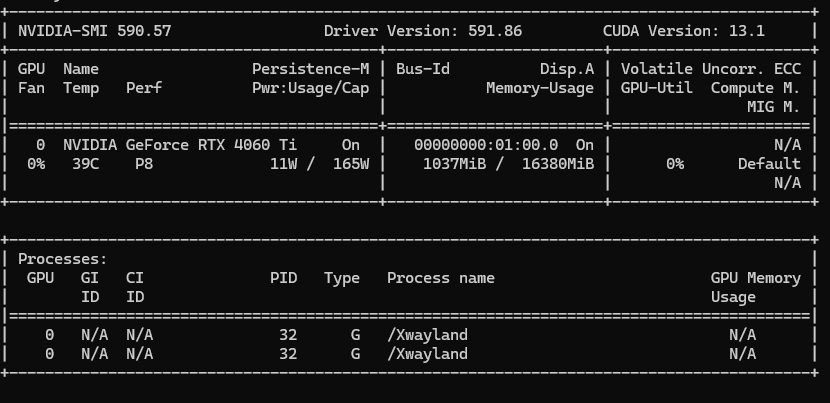
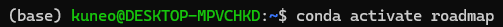
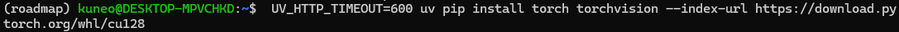
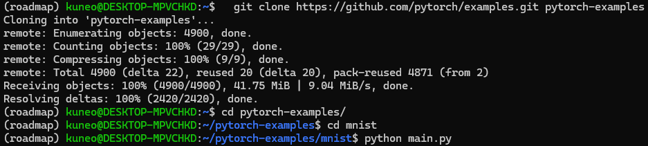
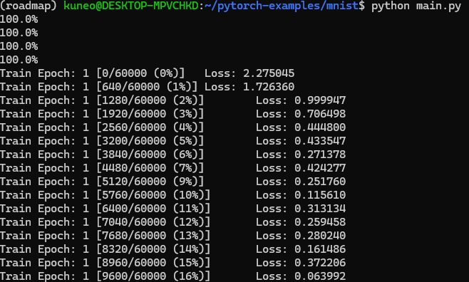
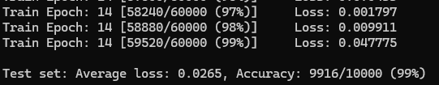

# 05/11 進度紀錄

安裝 Linux 環境、熟悉 conda 創建專屬環境、必要套件安裝。
執行一個 MNIST 的官方程式，並看過其程式碼。

## 使用設備

我家桌機：NVIDIA GeForce RTX 4060 Ti

目前是使用 WSL2，且安裝 miniforge，創建並進入 roadmap 專屬環境。

安裝 WSL 適用的 PyTorch。

執行 PyTorch 官方 MNIST code（灰階圖辨識數字）。

預設參數：

- batch size: 64
- epochs: 14
- learning rate: 1.0 (Adadelta)
- lr scheduler: StepLR (gamma=0.7)

### Final Accuracy

## 備註

`mnist_cnn.py` 裡的註解是 AI 寫完過後，自己讀過一遍，並有增加、修改過。
